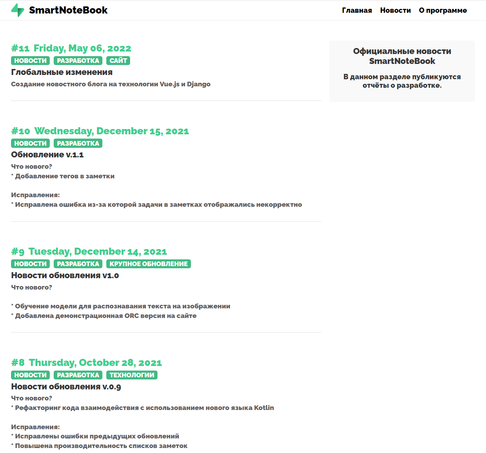
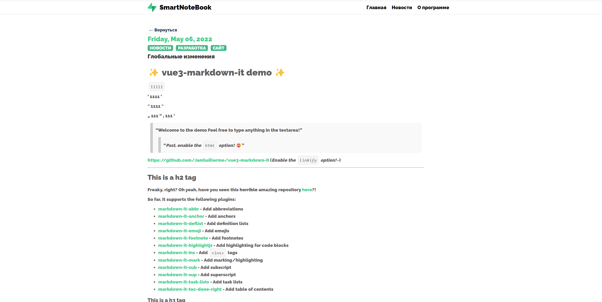

# JWT-django

Данный дипломный проект является частью [мобильного приложения](https://github.com/TheJecksMan/SmartNoteBookV1).

## Debug mode

**Запуск front-end:**

1. Перейти к папке:

```shell
$ cd frontend
```

2. Запустить:
```shell
$ npm run dev
```

**Запуск back-end:**

1. Перейти к папке:
```shell
$ cd JWT
```

2. Запустить проект:
```shell
$ python manage.py runserver
```
## Production mode

1. Перейти к папке:

```shell
$ cd JWT
```

2. Запустить docker-compose:
```shell
$ docker-compose up -d --build
```

3. Сделать миграцию

```shell
$ docker exec -it <ID> python manage.py migrate
$ docker exec -it <ID> python manage.py makemigrations
```
4. Если некоторые базы данный не создались:
```shell
$ docker exec -it <ID> python manage.py migrate --run-syncdb
```

4. Создать superuser:
```shell
docker exec -it <ID> python manage.py createsuperuser
```

## Новости

### **Блог разработчкиа. Описывающий все изменения от версии к версии.**



### Поодержка Markdown



## О проекте

### **Краткая информация о проекте**

SmartNoteBook - создавался как дипломная работа. Проект предоставляет возможность создание/управления своими заметками.
Цель проекта состоит в том, чтобы показать минимальную работу с требуемыми технологиям.


